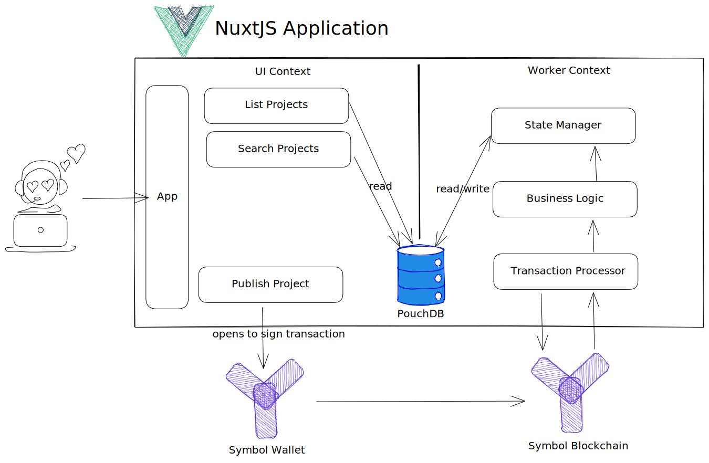

# symbol.directory

[](https://app.netlify.com/sites/symboldirectory/deploys)
[](https://github.com/aleixmorgadas/symbol.directory/actions/workflows/ci.yml)

## Why

Symbol.Directory purpose is to be the place to find anything regarding Symbol Blockchain. 

## Architecture



## Build Setup

```bash
# install dependencies
$ yarn install

# serve with hot reload at localhost:3000
$ yarn dev

# build for production and launch server
$ yarn build
$ yarn start

# generate static project
$ yarn generate
```

For detailed explanation on how things work, check out [Nuxt.js docs](https://nuxtjs.org).

## Docs

- [Architectural Decision Records](./doc/adr)

## Licensed

Copyright (c) 2021 Aleix Morgadas Licensed under the [AGPL-3.0 License](./LICENSE)